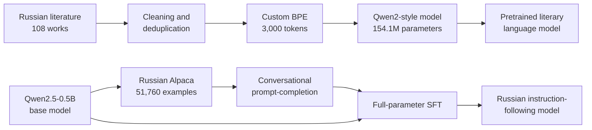

# Russian LLM Training Pipeline

An end-to-end language-model training project covering two core stages of modern LLM development:

1. **Pretraining from scratch** — a 154M-parameter Qwen2-style causal language model trained on Russian literature.
2. **Supervised fine-tuning (SFT)** — the 0.5B-parameter Qwen2.5 base model adapted to Russian instruction following.

The [notebook](./russian_llm_pretraining_and_sft.ipynb) contains the complete implementation and preserved outputs from the original experiments, including preprocessing statistics, evaluation metrics, checkpoints, and qualitative generations.

## Why this project

The goal is to demonstrate the full lifecycle of a small language model rather than only calling a pretrained API. The project covers corpus curation, tokenizer training, causal-language-model pretraining, instruction-data formatting, full-parameter SFT, evaluation, and before/after behavioral analysis.



## Key results

### Stage 1 — pretraining from scratch

| Item | Result |
|---|---:|
| Raw corpus | 108 literary works, 45.35M characters |
| Clean corpus | 489,180 unique Cyrillic sentences |
| Training data | 24,935 blocks of 512 tokens |
| Tokens per epoch | 12,739,063 |
| Tokenizer | Byte-level BPE, 3,000 tokens |
| Unknown-token rate | 0.00% |
| Model | Qwen2-style decoder, 154.1M parameters |
| Training | 3 epochs, effective batch size 64 |
| Final validation loss | **3.6199** |
| Final perplexity | **37.33** |

The model learned Russian punctuation, local grammar, literary vocabulary, and short-range prose structure. Its generations sound stylistically plausible, although long-range meaning remains unstable because the model saw only about 38M tokens across all three epochs.

### Stage 2 — Russian instruction tuning

| Item | Result |
|---|---:|
| Base model | `Qwen/Qwen2.5-0.5B` |
| Dataset | `d0rj/alpaca-cleaned-ru` |
| Split | 51,260 train / 500 validation |
| Format | `system → user → assistant` |
| Objective | Completion-only loss |
| Training | 2 epochs, effective batch size 64 |
| Sequence length | 512 tokens |
| Final validation loss | **1.3462** |
| Final perplexity | **3.84** |
| Mean token accuracy | **68.85%** |
| Runtime | **167 minutes** on an RTX 5080 Laptop GPU |

Before SFT, the base model mixed languages, leaked malformed dialogue markers, and produced unstructured continuations. After SFT, it consistently answered in Russian and adopted an assistant-like response format.

Example:

> **Question:** сколько планет в нашей солнечной системе?  
> **Before SFT:** В нашей соленой системе 8 планет... followed by corrupted multilingual tokens.  
> **After SFT:** Солнечная система состоит из 8 планет: Меркурий, Венера, Земля, Юпитер, Сатурн, Уран, Нептун и Марс.

The improvement is primarily behavioral: language consistency, response structure, and instruction following all improve substantially. The small model still makes factual and morphological mistakes, so the results should not be interpreted as production-grade question answering.

## Technical details

### Corpus preprocessing

- NFKC Unicode normalization
- whitespace, quote, and dash normalization
- repeated-punctuation cleanup
- sentence-level filtering of non-Cyrillic letters
- corpus-wide exact deduplication
- document-level train/validation split to reduce leakage

### Custom tokenizer

- byte-level BPE
- vocabulary size: 3,000
- special tokens: `<pad>`, `<unk>`, `<bos>`, `<eos>`, `<mask>`
- measured validation `<unk>` rate: 0%

### Pretraining model

| Configuration | Value |
|---|---:|
| Hidden size | 1,024 |
| Intermediate size | 2,048 |
| Layers | 16 |
| Attention heads | 16 |
| Key/value heads | 8 |
| Context length | 512 |
| Parameters | 154,133,504 |

Training uses Hugging Face `Trainer`, BF16, gradient checkpointing, fused AdamW, cosine learning-rate decay, and qualitative generation callbacks.

### SFT pipeline

The Alpaca fields are converted as follows:

```text
input       -> system
instruction -> user
output      -> assistant
```

Empty `input` values receive a fixed Russian system instruction. TRL's conversational prompt-completion format and `completion_only_loss=True` ensure that only assistant response tokens contribute to the loss.

## Repository structure

```text
russian-llm-training-pipeline/
├── README.md
├── requirements.txt
├── .gitignore
└── russian_llm_pretraining_and_sft.ipynb
```

Generated datasets, Hugging Face caches, checkpoints, and model weights are written under `artifacts/` and intentionally excluded from version control.

## Setup

Python 3.10+ and a CUDA-capable GPU are recommended. The recorded experiments used an NVIDIA RTX 5080 Laptop GPU with 16 GB VRAM.

```bash
python -m venv .venv

# Windows
.venv\Scripts\activate

# Linux/macOS
source .venv/bin/activate

pip install -r requirements.txt
jupyter notebook russian_llm_pretraining_and_sft.ipynb
```

### Literature corpus

Place the Russian literature files here:

```text
data/
└── corpus/
    ├── book_01.txt
    ├── book_02.txt
    └── ...
```

In the original workspace, the translated notebook also detects the existing course corpus at `../project/data/corpus`, so no data duplication is required.

The SFT dataset and Qwen2.5 weights are downloaded automatically from the Hugging Face Hub.

## Reproducing the experiments

Run the notebook from top to bottom. Both long-running training cells automatically resume from the most recent checkpoint.

The notebook was validated with:

- PyTorch `2.12.0.dev` with CUDA 12.8
- Transformers `5.14.0`
- Datasets `5.0.0`
- Tokenizers `0.22.2`
- Accelerate `1.14.0`
- TRL `1.8.0`

API names may differ in older releases of Transformers or TRL.

## Limitations and next steps

- The pretraining corpus is very small relative to the 154M-parameter model.
- The held-out split contains six works and does not represent broad Russian-language evaluation.
- About 19.75% of sampled SFT conversations exceed 512 tokens and are truncated.
- Generation quality is evaluated mainly through loss, perplexity, token accuracy, and four qualitative prompts.
- The SFT model can produce plausible but factually incorrect answers.

Potential extensions:

- increase pretraining data and context length;
- use sequence packing for more efficient SFT;
- compare full fine-tuning with LoRA/QLoRA;
- add Russian instruction-following and factuality benchmarks;
- evaluate multiple decoding strategies;
- publish model cards and inference demos for the trained checkpoints.

## Notes on preserved outputs

The notebook is an English-language copy of the completed experiment. Markdown, comments, docstrings, and runtime labels were translated, while all existing output objects and execution counters were preserved byte-for-byte at the notebook-structure level. Russian prompts and generated responses remain in Russian because they are part of the experiment itself.
